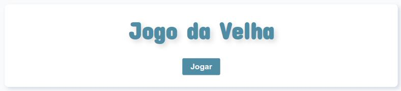

# Jogo da velha





> Jogo da velha para um jogador, contra a maquina. Jogadas da maquina controladas inteiramente pelo service, dando a possibilidade de três resultados: você vence, a maquina vence e empate.

## 🚀 Instalando jogo-da-velha

Para instalar o jogo-da-velha, siga estas etapas:

Linux, macOS e Windows:
```
yarn install
```
```
ng serve
```

## 📫 Contribuindo para jogo-da-velha  

Para contribuir com jogo-da-velha, siga estas etapas:

1. Bifurque este repositório.
2. Crie um branch: `git checkout -b <nome_branch>`.
3. Faça suas alterações e confirme-as: `git commit -m '<mensagem_commit>'`
4. Envie para o branch original: `git push origin jogo-da-velha / <local>`
5. Crie a solicitação de pull.

## 🤝 Colaboradores

<table>
  <tr>
    <td align="center">
      <a href="#">
        <br>
        <sub>
          <b>Madalena Campos</b>
        </sub>
      </a>
    </td>
  </tr>
</table>

[⬆ Voltar ao topo](#jogo-da-velha)<br>
